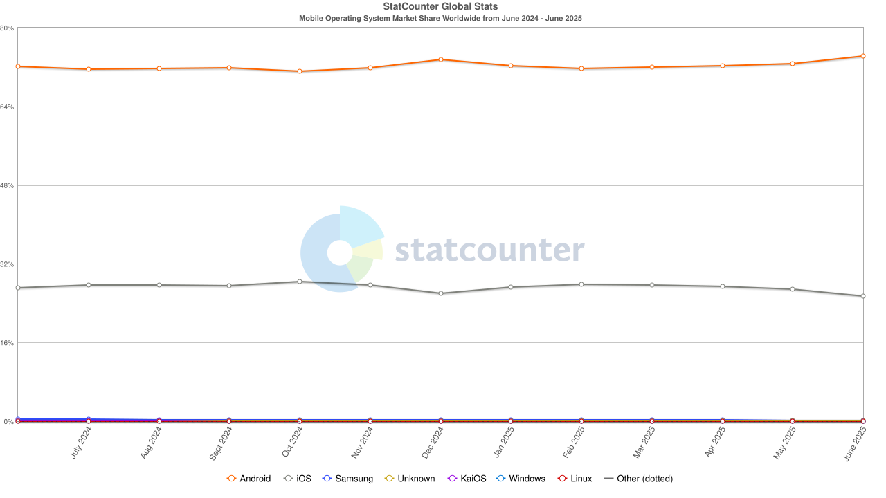
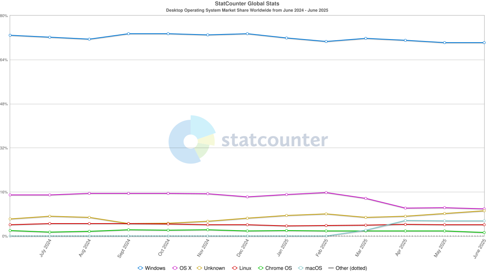

  <table>
    <thead>
      <tr>
        <th rowspan="3">
          
        </th>
        <th>
          
        </th>
      </tr>
      <tr>
        <th>
          
        </th>
      </tr>
      <tr>
        <th>
          
        </th>
      </tr>
    </thead>
    <tbody>
  </table>

<picture>
  <source media="(prefers-color-scheme: dark)" srcset="https://raw.githubusercontent.com/Infer2/Infer2/uwu/github-snake-dark.svg" />
  <source media="(prefers-color-scheme: light)" srcset="https://raw.githubusercontent.com/Infer2/Infer2/uwu/github-snake.svg" />
  
</picture>
<h3>📱 Mobile OS Market Share (2024–2025)</h3>

<h3>🖥️ Desktop OS Market Share (2024–2025)</h3>

<!-- uwuu --/>
